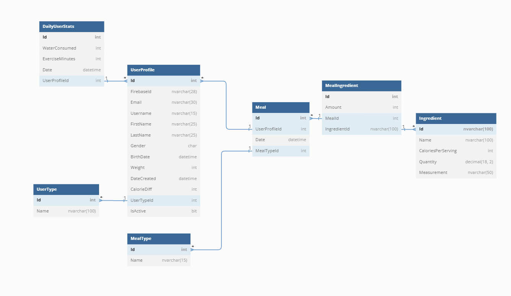

# NutriHelp

This is my solo capstone project for NSS.  
It is a calorie-tracking application that allows users to track their calories and other health information daily.  
I decided to make this application because I am passionate about health and fitness.

## Stack

### Front End

- [React.js](https://reactjs.org/)
- [React Router](https://reactrouter.com/en/main)
- [React Select](https://react-select.com/home)
- [Bootstrap/Reactstrap](https://reactstrap.github.io/?path=/docs/)

### Back End

- [C# .NET](https://dotnet.microsoft.com/en-us/languages/csharp)
- [ASP.NET Web API](https://dotnet.microsoft.com/en-us/apps/aspnet/apis)
- [Microsoft SQL Server (T-SQL)](https://learn.microsoft.com/en-us/sql/database-engine/install-windows/install-sql-server?view=sql-server-ver16)
- [Google Firebase (Authentication)](https://console.firebase.google.com/)
- [Nutritionix (Public Food API)](https://www.nutritionix.com/api)

### Other

- [dbdiagram (ERD)](https://dbdiagram.io/home)
- [jest(TDD)](https://jestjs.io/docs/getting-started)  
- [xUnit (TDD)](https://xunit.net/)
  
## API

  
This is a visual representation of the Database.  
  
### Documentation

A link to the documentation for the API can be found [here](./docs/api-documentation.md).

# Installation

### Step 1

Clone the repository from command line  

### Step 2

Change to the **`client`** directory, and type `npm install`  

### Step 3

Run all of the sql scripts **IN ORDER**  

### Step 4

Open the `.sln` file in Visual Studio and run the **`NutriHelp`** profile  

### Step 5

Back in the **`client`** directory, type `npm start`

# Project Journey

## Purpose & Motivation

Throughout the year 2022, I managed to lose 100 lbs. My starting weight was 300. The difference in my life is outstanding and I have a great appreciation for health and fitness now.  
Designing and developing **`NutriHelp`** was an easy decision, and I enjoyed coding it every step of the way.

## How does it work?

## Users

When the user first enters the website, they are prompted to Register or Login. The registration form has two parts: credentials & other user information. I split up the form to improve UX.  
There is a also a random positive message displayed out of 50 possible messages, and a button to navigate users to a detailed view.  
  
Once logged in, the user sees their [Daily Rundown](https://prnt.sc/RffrwWVEpw_D), which consists of a Calorie & Water goal, and any logged exercise for the day. Below that, there is a random positive message (out of 50), and a button to navigate them to a detailed view.  

Once they click the Detailed View button, or click `Daily` in the navbar, they are greeted with [this view](https://prnt.sc/z9sJ_c154cDI). On the `Daily` page, the user can edit their food eaten that day, as well as their current weight/water drank/exercise.  
  
A user can also edit their profile at `Profile`, and see FAQs at `Support`.  
  
### Admins

Admins only have one page currently -- their [Home page](https://prnt.sc/ClU9D5BCNwGY). Here, they can activate/deactivate users, and filter by their IsActive status.  
_This view is paginated, and the Admin can choose how many to see per page._

## Video Walkthrough

https://user-images.githubusercontent.com/110187145/217970280-51ce7915-89c2-4ca1-8cdf-e7c5aaba7b00.mp4

_May be updated to a voice-guided tour in the future._  
  
Please note: I am aware of the security risk of debouncing emails and usernames. I would not host the website publicly with that feature. I implemented it so I could learn debouncing, and React's `useRef` hook.
